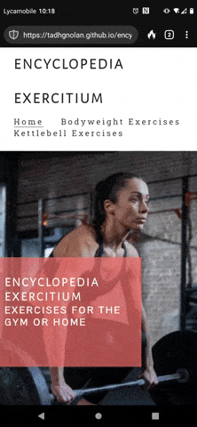

# ENCYCLOPEDIA EXERCITIUM

Encyclopedia Exercitium is a fitness webstite that aims to be a singuar scaleable repository for strength and conditioning exercise description, instruction and visual examples.

Users would be looking to improve their strength and conditioning capability and knowledge of exercises for use at home or in the gym.

Users would be a demographic who at least have some familiar with strength and conditioning.

Users would be over the age of 16, but any age above, as long as they are physically capable.

## UX

### Colour Scheme

- `#3a3a3a` used for primary text.
- `#252525` used for secondary text.
- `#ffffff` used for tertiary text and borders.
- `#fafafa` used for text over background images.
- `#f16d6b` used for background color.
- `#000000` used for background color.

### Typography

- [Fontjoy](https://fontjoy.com/) was used to generate a matching font combination based around Roboto Slab for comfortable reading. 

- [Alegreya Sans SC](https://fonts.google.com/specimen/Alegreya+Sans+SC?query=Alegreya+Sans+SC) was used for the primary headers and titles.

- [Pontano Sans](https://fonts.google.com/specimen/Pontano+Sans?query=Pontano+Sans) was used for all other secondary text.

- [Roboto Slab](https://fonts.google.com/specimen/Roboto+Slab?query=Roboto+Slab) was used fpr any  remaining text.

- [Font Awesome](https://fontawesome.com) icons were used throughout the site, such as the social media icons in the footer.

## User Stories

In this section, list all of your user stories for the project.

### New Site Users

- As a new site user, I would like to learn new exercises, so that I can improve my workouts.
- As a new site user, I would like to observe correct technique, so that I can perform exercises correctly.
- As a new site user, I would like to learn new exercises, so that I can add variety to my workouts.

### Returning Site Users

- As a returning site user, I would like to have access to social media links, so that I can see what the creator is working on and any related media that they post.
- As a returning site user, I would like to be able to email the creator, so that I can submit feedback.
- As a returning site user, I would like to be able access the blog, so that I can learn useful information or see what changes are coming to the site.

## Wireframes

### Home Page Wireframes

| Size | Screenshot |
| --- | --- |
| Mobile |  |

### Category Page Wireframes

| Size | Screenshot |
| --- | --- |
| Mobile |  |

### Contact Page Wireframes

| Size | Screenshot |
| --- | --- |
| Mobile |  |

### About Page Wireframes

| Size | Screenshot |
| --- | --- |
| Mobile |  |

## Features

### Existing Features

- **Home Page**

    - A welcoming home page that presents the user with a simple, but clear description of the sites purpose, some pleasant relevant images, an easily visible navbar directly to the site content a section that will link to future blog content, a contact form and social media links.

- **Logo**

    - A large clear logo displaying the name of the website. Clicking it will return/reload the homepage.

- **Navbar**

    - Navbar: Standard navbar at top of page to allow users to easily access information. Underlines on mouse hover. 
    						- Logo: Returns to the home page when clicked.
                            - Home: Returns to the home page from whichever page the user is on.
                            - Bodyweight Exercises: Links directly to a page with instructions 								  and demonstration images for performing bodyweight exercises.
                            - Kettlebell Exercises: Links directly to a page with instructions 
							  and demonstration images for performing kettlebell exercises.
                              

- **Hero Image**

	- A large hero image with a zoom animation to welcome users to the site.
    

- **Cover Text**
	
    - Cover text on a transparent color background hovering over the hero image. It declares the 
    basic premise of the site to users.
    

- **Blog List**
	
    - Boxes of text over an image denoting a blog post for each month.
    

- **Contact Form**

	- Contact form for users to email creator (non-functional, no database).
    

- **Bodyweight Exercises Page**
	
    - Page listing instructions for bodyweight resistance exercises with .gif images for 			demonstration purposes.
    

- **Kettlebell Exercises Page**
	
    - Page listing instructions for kettlebell resistance exercises with .gif images for 			demonstration purposes.
    

### Future Features

- Blog
    - Monthly blogs on main page. Blog list boxes used as buttons to smooth scrool to blog post on same page.
    
- Hamburger menu
    - Navbar will switch to hamburger menu for mobile devices with media query.

- Full workout section
    - New section with videos demonstrating a variety of different intensity workouts.

## Tools & Technologies Used

- [HTML](https://en.wikipedia.org/wiki/HTML) used for the main site content.
- [CSS](https://en.wikipedia.org/wiki/CSS) used for the main site design and layout.
- [Git](https://git-scm.com) used for version control. (`git add`, `git commit`, `git push`)
- [GitHub](https://github.com) used for secure online code storage.
- [GitHub Pages](https://pages.github.com) used for hosting the deployed front-end site.
- [Gitpod](https://gitpod.io) used as a cloud-based IDE for development.

# Testing

- Navbar: Functions as intended on mobile, tablet and desktop
  
  
  
  
  
  

## Code Validation
- https://validator.w3.org/nu/?doc=https%3A%2F%2Ftadhgnolan.github.io%2Fencyclopedia-exercitium%2F

- Caught several trailing slashes.

- Caught font families with white spaces and no quotation marks. 

- Removed both and passed.

## Responsiveness
- Website performed normally on mobile, desktop and tablet:

- Lighthouse
 
 
 
 
## Deployment

The site was deployed to GitHub Pages. The steps to deploy are as follows:
- In the [GitHub repository](https://github.com/tadhgnolan/encyclopedia-exercitium), navigate to the Settings tab 
- From the source section drop-down menu, select the **Main** Branch, then click "Save".
- The page will be automatically refreshed with a detailed ribbon display to indicate the successful deployment.

The live link can be found [here](https://tadhgnolan.github.io/encyclopedia-exercitium)

### Local Deployment

This project can be cloned or forked in order to make a local copy on your own system.

#### Cloning

You can clone the repository by following these steps:

1. Go to the [GitHub repository](https://github.com/tadhgnolan/encyclopedia-exercitium) 
2. Locate the Code button above the list of files and click it 
3. Select if you prefer to clone using HTTPS, SSH, or GitHub CLI and click the copy button to copy the URL to your clipboard
4. Open Git Bash or Terminal
5. Change the current working directory to the one where you want the cloned directory
6. In your IDE Terminal, type the following command to clone my repository:
	- `git clone https://github.com/tadhgnolan/encyclopedia-exercitium.git`
7. Press Enter to create your local clone.

Alternatively, if using Gitpod, you can click below to create your own workspace using this repository.

Please note that in order to directly open the project in Gitpod, you need to have the browser extension installed.
A tutorial on how to do that can be found [here](https://www.gitpod.io/docs/configure/user-settings/browser-extension).

#### Forking

By forking the GitHub Repository, we make a copy of the original repository on our GitHub account to view and/or make changes without affecting the original owner's repository.
You can fork this repository by using the following steps:

1. Log in to GitHub and locate the [GitHub Repository](https://github.com/tadhgnolan/encyclopedia-exercitium)
2. At the top of the Repository (not top of page) just above the "Settings" Button on the menu, locate the "Fork" Button.
3. Once clicked, you should now have a copy of the original repository in your own GitHub account!

## Credits

### Content

| Source | Location | Notes |
| --- | --- | --- |
| [Love Running by Code Institute](https://github.com/Code-Institute-Solutions/love-running-2.0-sourcecode/) | General Structure | Used html and css for layout of site |
| [Katrina Kirsch](https://blog.hubspot.com/marketing/hero-image) | hero image | Ultimate Guide to Hero Images [Best Practices + Examples] |
| [REM to PX Converter](https://pixelsconverter.com/rem-to-px) | entire site | used to convert pixel values to REM values |
| [Shreya Bose](https://www.browserstack.com/guide/ideal-screen-sizes-for-responsive-design) | media queries | referenced when trying to decide best values for responsive design |
| [Font Awesome](https://fontawesome.com/icons/facebook?s=&f=brands) | social media icons | used for Facebook icon in footer |
| [Font Awesome](https://fontawesome.com/icons/square-twitter?s=&f=brands) | social media Icons | used for Twitter icon in footer |
| [Font Awesome](https://fontawesome.com/icons/square-youtube?s=&f=brands) | social media Icons | used for Youtube icon in footer |
| [Font Awesome](https://fontawesome.com/icons/instagram?s=&f=brands) | social media icons | used for Instagram icon in footer |
| [Am I Responsive](https://ui.dev/amiresponsive?) | documentation | used to generate a mockup of website on multiple devices for documentation |
| [Rachel Cravit](https://venngage.com/blog/color-blind-friendly-palette/) | selecting colors | was helpful in choosing color palette |
| [Stack Overflow](https://stackoverflow.com/questions/37660902/why-is-my-navigation-list-reversed) | Navigation | Helped when trying to orient navigation menu correctly |
| [W3Schools](https://www.w3schools.com/css/css_form.asp) | form | used while designing and styling contact form |
| [Rapid Tables](https://www.rapidtables.com/convert/color/index.html) | entire site | used when converting colors to hex |
| [Font Joy](https://fontjoy.com/) | font | used during font selection |

### Media

| Source | Location | Type | Notes |
| --- | --- | --- | --- |
| [Me](assets/images/press_up.gif) | Bodyweight Exercises | Exercise demonstration |
| [Me](assets/images/bodyweight_lunge.gif) | Bodyweight Exercises | image| exercise demonstration |
| [Me](assets/images/bodyweight_squat.gif) | Bodyweight Exercises | image | exercise demonstration |
| [Me](assets/images/kettlebell_press.gif) | Kettlebell Exercises | image | exercise demonstration |
| [Me](assets/images/kettlebell_lunge.gif) | Kettlebell Exercises | image | exercise demonstration |
| [Me](assets/images/kettlebell_squat.gif) | Kettlebell Exercises | image | exercise demonstration |
| [Pexels](https://www.pexels.com) | home page | image | hero image |
| [GIMP](https://www.gimp.org/) | entire site | image software | used to convert image types, and alter image properties |

### Acknowledgements

- I would like to thank my brother Cormac, for his help and mentorship through this project.

- I would like to thank my mentor, Tim Nelson for his help throughout.

- I would like to thank the [Code Institute Slack community](https://code-institute-room.slack.com) for the moral support; it kept me going during periods of self doubt and imposter syndrome.
- I would like to thank my spouse/partner Rossana, for believing in me, and allowing me to make this transition into software development.
- I would like to thank my employer, for supporting me in my career development change towards becoming a software developer.
